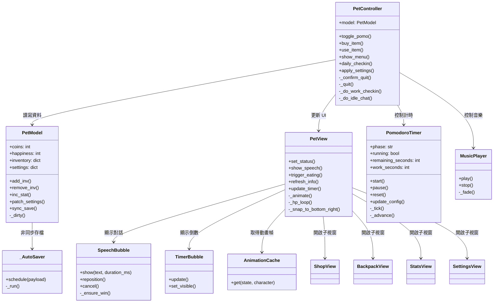
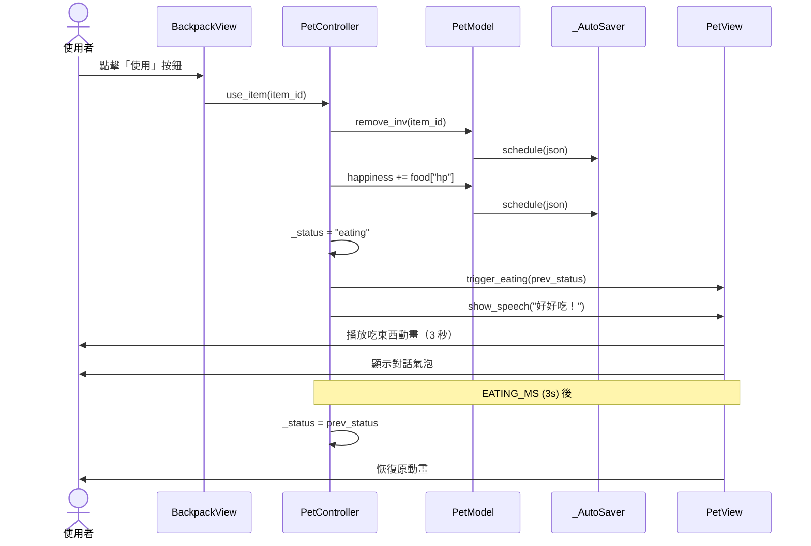
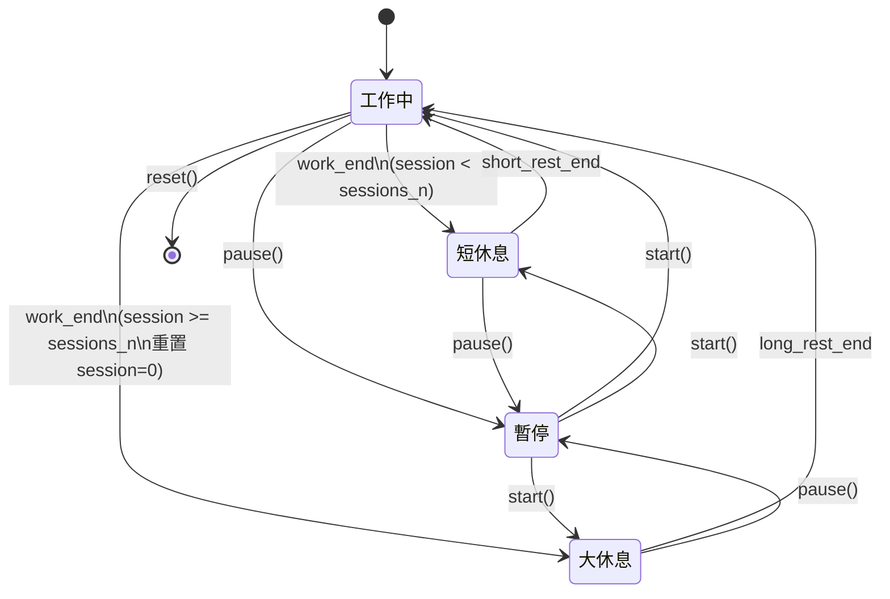
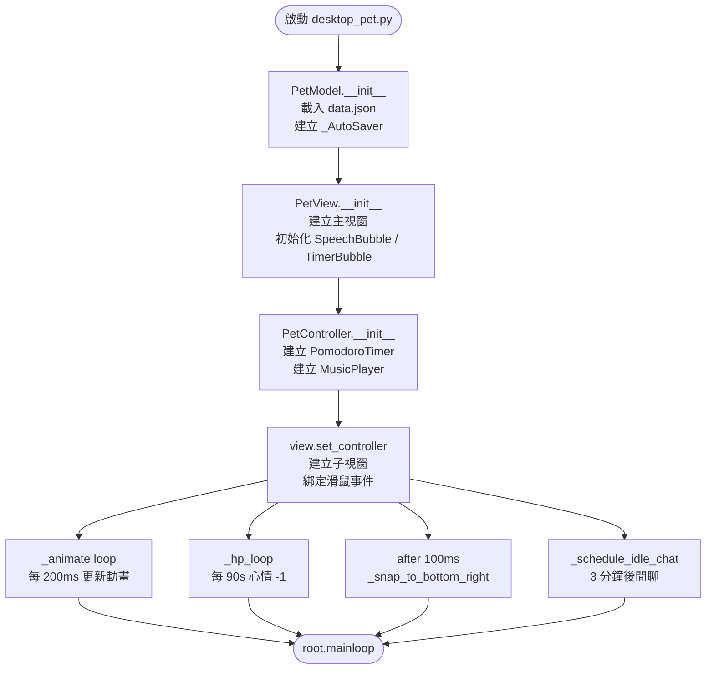

# 桌面寵物專案開發紀錄

## 專案現況

本專案是以 Python Tkinter 製作的桌面寵物程式，核心功能包含：

- 桌面寵物顯示與拖曳
- 右鍵選單操作
- 番茄鐘讀書計時
- 寵物心情值、金幣、每日簽到
- 商店、背包、道具使用
- 讀書音樂播放
- 對話氣泡提醒

目前主程式集中在 `desktop_pet.py`，資料儲存在 `data.json`，角色圖片與音樂放在 `assets` 目錄。

## 目前素材狀態

`assets` 目錄不是空的，目前已有角色圖片與音樂素材。

目前檢查到的素材結構：

```text
assets/
  assets/
    icon.ico
    idle/
    coding/
    studying/
    eating/
    drag/
    music/
      study.mp3
```

注意：目前素材實際路徑是 `assets/assets/...`，程式原本預期是 `assets/...`。已在程式中加入相容邏輯，讓兩種結構都能讀取。

## 已修正問題

### 1. 右鍵選單一閃即逝

問題原因：

原本 `show_menu()` 在 `menu.tk_popup()` 後的 `finally` 立即呼叫 `menu.unpost()`，導致右鍵選單剛顯示就被關閉。

修正方式：

- 移除立即 `unpost()` 的流程。
- 保留 `grab_release()`。
- 用 `<Unmap>` 事件清除目前選單紀錄。
- 移除動畫迴圈中會每 200ms 強制關閉選單的邏輯。

### 2. 吃東西期間心情仍會下降

問題原因：

吃東西動畫只改變 View 的狀態，Controller 的 `_status` 沒有同步變成 `eating`，所以 `on_hp_tick()` 仍然會扣心情值。

修正方式：

- 使用食物時同步將 Controller 狀態設為 `eating`。
- 吃東西動畫結束後恢復原本狀態。
- 關閉程式時會取消尚未執行的恢復排程。

### 3. 設定頁套用後角色被重設

問題原因：

設定頁 `_apply()` 將 `character` 固定傳入 `"default"`，導致使用者原本儲存的角色設定被覆蓋。

修正方式：

- 套用設定時保留目前 `model.settings["character"]`。

### 4. 關閉程式時 SpeechBubble 可能拋出 TclError

問題原因：

對話氣泡的 `after()` callback 可能在主視窗已銷毀後才執行，造成 Toplevel 建立或操作失敗。

修正方式：

- `SpeechBubble.show()` 與 `_ensure_win()` 先檢查 parent 是否仍存在。
- 如果視窗已銷毀，直接略過顯示。

### 5. 番茄鐘提醒排程可能在關閉後執行

問題原因：

工作提醒與閒聊提醒使用 `after()` 排程，若關閉流程沒有完整取消，可能在視窗不存在時仍執行。

修正方式：

- Controller 加入 `_is_alive()` 檢查。
- 工作提醒、工作關心、閒聊提醒都會在執行前確認視窗存在。
- `_quit()` 會取消工作開始提醒、工作關心、閒聊、吃東西恢復排程。

### 6. `_do_work_checkin()` 直接讀取 PomodoroTimer 私有欄位

問題原因：

原本直接讀取 `self._pomo._remain` 與 `self._pomo._work_s`，耦合太高。

修正方式：

- 在 `PomodoroTimer` 加入 `remaining_seconds` 與 `work_seconds` property。
- Controller 改用公開屬性讀取。

### 7. 開啟時右下角定位可能偏掉

問題原因：

程式原本使用 `after(0)` 立刻定位，若 layout 還沒完成，`winfo_width()` 可能回傳 1。

修正方式：

- 改成延遲 100ms 定位。
- 若寬高仍小於等於 1，會再排一次定位。

### 7. 結束程式時選單殘留需兩次點擊

問題原因：

`_exit_app()` 使用 `after_idle(_quit)` 延遲結束，但 `overrideredirect` 視窗的 grab 在 idle 排程執行前尚未完全釋放，下一次滑鼠點擊被 grab 消耗，造成需要兩次點擊才能完全關閉。

修正方式：

- `_exit_app` 改先 `grab_release()` 再 `unpost()`，並改用 `after(50, _quit)` 給釋放留足時間。
- `_quit()` 最前面加一道 `root.grab_release()` 保險。

### 8. 右鍵選單食物快捷列表移除

問題原因：

右鍵選單會列出背包中所有食物，隨著購買越來越多食物，選單項目堆積不乾淨。

修正方式：

- 刪除 `show_menu()` 中的「餵食」block（原 1708–1718 行）。
- 食物統一透過「🎒 背包」視窗管理與使用。

## 已由 dev-feature 合併進來的修正

- `remove_inv` 數量歸零後會刪除 item key。
- 離開程式時會呼叫 `sync_save()`，降低存檔遺失風險。
- `_deep_merge` 對 inventory 這類動態 dict 會保留已儲存項目。
- 新增角色對話與浮動氣泡視窗功能。

## 待確認或可後續改善

### 1. 素材目錄可以整理

目前程式已相容 `assets/assets/...`，但專案結構可整理成：

```text
assets/
  icon.ico
  idle/
  coding/
  studying/
  eating/
  drag/
  music/
```

整理後打包設定會更直覺。

### 2. 程式文字編碼或部分字串需檢查

部分註解或 UI 字串在終端輸出中可能出現亂碼。若要做正式報告或展示，建議確認：

- 檔案是否為 UTF-8。
- VS Code 是否用 UTF-8 開啟。
- PowerShell 終端是否支援 UTF-8 顯示。

### 3. 可加入角色切換 UI

目前設定保留 `character`，但設定頁還沒有完整角色選擇介面。後續可以加入：

- 角色下拉選單
- 角色預覽
- 不同角色資料夾掃描

### 4. 可加入更多測試案例

目前主要靠手動測試與 `py_compile` 驗證語法。後續若時間足夠，可以補：

- `PetModel` inventory 測試
- `PomodoroTimer` 狀態切換測試
- `asset_path()` 路徑相容測試

## 期末報告可用架構

### 一、研究動機

說明為什麼要做桌面寵物，例如：

- 增加讀書或工作的陪伴感。
- 用番茄鐘協助專注。
- 用寵物心情與獎勵機制提高使用者互動意願。

### 二、系統功能

可分成以下模組介紹：

- 桌面寵物顯示模組
- 動畫素材載入模組
- 番茄鐘計時模組
- 商店與背包模組
- 資料儲存模組
- 音樂播放模組
- 對話氣泡模組

### 三、系統架構

目前程式接近 MVC 架構：

- Model：`PetModel`，負責資料、存檔、背包、金幣、心情值。
- View：`PetView`、`ShopView`、`BackpackView`、`StatsView`、`SettingsView`，負責 Tkinter 介面。
- Controller：`PetController`，負責操作流程、事件處理、番茄鐘與 View/Model 串接。
- Service：`AnimationCache`、`MusicPlayer`、`PomodoroTimer`。

### 四、開發問題與解決方式

可整理本文件「已修正問題」區塊，放進報告的問題解決章節。

建議挑 3 到 5 個重點：

- 右鍵選單一閃即逝
- 素材路徑不一致
- 吃東西狀態不同步
- 設定套用覆蓋角色
- 關閉程式時 after callback 造成例外

### 五、成果展示

可以放：

- 桌面寵物待機畫面
- 右鍵選單
- 番茄鐘畫面
- 商店與背包
- 吃東西動畫
- 對話氣泡

### 六、未來改進

可列：

- 加入更多角色與動作素材。
- 補上角色切換設定頁。
- 增加更多互動事件。
- 改善 UI 文字與版面。
- 將程式打包成 exe，方便一般使用者執行。

## 既有報告檔案

專案目錄內已有：

```text
期末專題報告.pdf
```

後續可以根據這份 PDF 與本 Markdown 紀錄，整理成新的報告架構或簡報內容。

---

## 架構圖（Mermaid）

> 架構有異動時請同步更新此節。

### 1. MVC 類別架構



---

### 2. 使用食物完整流程



---

### 3. 番茄鐘狀態機



---

### 4. 程式啟動流程


