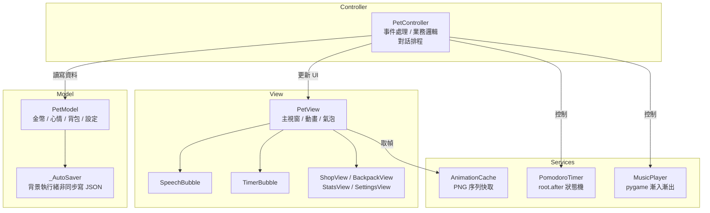

# 桌面小寵物 (Desktop Pet)

> 視窗程式設計期末專題 ｜ 彰化師範大學 資訊工程學系

一隻住在你桌面上的小寵物。結合**番茄鐘工作法**、**虛擬貨幣商店**與**心情養成系統**，讓讀書和寫程式多一點陪伴。


---

## 功能特色

| 功能 | 說明 |
|------|------|
| 動畫精靈 | 多狀態 PNG 序列動畫（idle / coding / studying / eating / drag / alert / sleep） |
| 番茄鐘計時器 | 工作、短休息、大休息三階段，彩色 HUD 顯示進度條；完成後自動獎勵金幣 |
| 角色對話氣泡 | 工作中定時關心、心情下降提醒、吃東西反應、發呆閒聊 |
| 金幣系統 | 番茄鐘 +10 金幣（可加倍）、每日簽到 +5 金幣 |
| 寵物商店 | 食物補充心情值；道具有藥水、禮盒、加倍符文、裝飾品 |
| 背包系統 | 購買後存入背包，開啟背包視窗後點擊使用 |
| 心情養成 | 心情每 90 秒衰減 -1，需定期餵食照顧；低於 30% / 60% 觸發對話提醒 |
| 每日簽到 | 每天首次開啟商店可簽到，領取 +5 金幣 |
| 個人化設定 | 寵物名稱、番茄鐘時長、每輪節數、自動開始、永遠置頂 |
| 自動存檔 | 每次狀態變動立即以背景執行緒寫入 `data.json`，重啟後完整保留 |
| 結束確認 | 點選「結束程式」後跳出確認視窗，防止誤觸 |

---

## 安裝與執行

### 必要環境

- Python 3.10+
- tkinter（Python 內建）

### 選用依賴

```bash
pip install pillow pygame
```

| 套件 | 用途 | 未安裝時 |
|------|------|---------|
| Pillow | 載入 PNG 動畫序列 | 顯示備用文字寵物 `(ovo)` |
| pygame | 讀書模式背景音樂 | 靜音執行，其餘功能正常 |

### 執行

```bash
python desktop_pet.py
```

---

## 操作說明

| 操作 | 功能 |
|------|------|
| 左鍵拖曳 | 將寵物移動至螢幕任意位置 |
| 右鍵單擊 | 開啟主選單：活動切換、商店、背包、音樂、番茄鐘、統計、設定、結束程式 |

### 番茄鐘快速預設

| 預設 | 工作 | 短休息 | 大休息 |
|------|------|-------|-------|
| 經典 | 25 分 | 5 分 | 15 分 |
| 雙倍 | 50 分 | 10 分 | 30 分 |
| 迷你 | 15 分 | 3 分 | 10 分 |

### 商店道具

**食物**

| 道具 | 費用 | 心情回復 |
|------|------|---------|
| 蘋果 | 2 | +15 |
| 珍珠奶茶 | 3 | +20 |
| 咖啡 | 4 | +25 |
| 漢堡 | 5 | +30 |
| 壽司 | 6 | +35 |
| 生日蛋糕 | 8 | +50 |

**道具**

| 道具 | 費用 | 效果 |
|------|------|------|
| 快樂藥水 | 10 | 心情立即恢復 100% |
| 神秘禮盒 | 12 | 隨機獲得 5～30 金幣 |
| 加倍符文 | 15 | 下個番茄鐘金幣 ×2 |
| 蝴蝶結 | 20 | 可愛裝飾品 |

---

## 專案結構

```
Dpet/
├── desktop_pet.py      # 主程式（單檔 MVC 架構）
├── data.json           # 自動產生的存檔
└── assets/
    ├── idle/           # 待機動畫 PNG 序列
    ├── coding/         # 寫程式動畫 PNG 序列
    ├── studying/       # 讀書動畫 PNG 序列
    ├── eating/         # 吃東西動畫 PNG 序列
    ├── drag/           # 拖曳動畫 PNG 序列
    ├── alert/          # 警示動畫 PNG 序列
    ├── sleep/          # 睡覺動畫 PNG 序列（可選）
    └── music/
        └── study.mp3   # 讀書背景音樂（可選）
```

> 動畫資料夾內的 PNG 以檔名字母順序載入並循環播放，圖片與音樂皆為可選。

---

## 架構說明（MVC）



整個專案以單一檔案 `desktop_pet.py` 實作，分為四個明確分層：

| 層級 | 類別 / 函式 | 職責 |
|------|------------|------|
| **Layer 1 — Model** | `PetModel`、`_AutoSaver` | 純資料層，不含任何 tkinter。`_AutoSaver` 以 daemon 執行緒非同步寫入 JSON，避免 GUI 卡頓。 |
| **Layer 2 — Services** | `AnimationCache`、`MusicPlayer`、`PomodoroTimer` | 業務邏輯，不依賴 tkinter。動畫快取、pygame 淡入淡出播放器、`root.after()` 驅動的番茄鐘計時器。 |
| **Layer 3 — View** | `TimerBubble`、`SpeechBubble`、`_ItemCard`、`ShopView`、`BackpackView`、`StatsView`、`SettingsView`、`PetView` | 純渲染層，不含業務邏輯。透過 `set_controller()` 連結 Controller 後才啟動事件綁定。 |
| **Layer 4 — Controller** | `PetController` | 接收 View 事件 → 操作 Model → 驅動 View 更新。持有 `PomodoroTimer` 與 `MusicPlayer`，管理對話氣泡排程。 |

### 主要元件說明

- **`TimerBubble`** — Canvas 繪製圓角計時 HUD，顯示在寵物頭頂；含進度條與階段文字，三色區分工作 / 短休息 / 大休息。
- **`SpeechBubble`** — 獨立 `Toplevel` 浮動視窗，Canvas 繪製圓角氣泡 + 向下三角尾巴；拖曳寵物時跟隨移動，N 秒後自動隱藏。
- **`PetView`** — `overrideredirect=True` 無邊框視窗，使用 `-transparentcolor` 實現透明背景；右鍵選單以 `menu.tk_popup()` 呈現，關閉時透過 `<Unmap>` 事件釋放 grab。
- **`PomodoroTimer`** — 支援工作→短休息→（第 N 節）→大休息的完整週期；`update_config()` 可在執行中熱更新所有參數。

---

## 存檔格式

存檔路徑：執行檔或 `.py` 的同層目錄下的 `data.json`。

```json
{
  "pet_name": "小白",
  "coins": 0,
  "happiness": 100,
  "bonus_mult": 1,
  "last_checkin": "",
  "inventory": {},
  "stats": {
    "pomodoro_done": 0,
    "coins_earned": 0,
    "coins_spent": 0,
    "items_used": 0
  },
  "settings": {
    "work_min": 25,
    "rest_min": 5,
    "long_rest_min": 15,
    "sessions_before_long": 4,
    "auto_start": false,
    "always_on_top": true,
    "character": "default"
  }
}
```

載入時使用深層合併（`_deep_merge`）：已定義欄位從存檔更新，動態欄位（如 `inventory`）完整保留，未知舊欄位自動捨棄，確保版本相容性。

---

## 打包為 exe（PyInstaller）

```powershell
pip install pyinstaller
pyinstaller --onefile --windowed --name DesktopPet `
    --add-data "assets;assets" `
    desktop_pet.py
```

執行檔輸出至 `dist/DesktopPet.exe`，需將 `assets/` 資料夾放在 exe 同層目錄。`data.json` 也會儲存於 exe 同層目錄（非 PyInstaller 的臨時目錄）。

---

## 開發環境

- Python 3.12 / Windows 11
- Pillow 10、pygame 2.6

---

## 授權

本專案以 [MIT License](LICENSE) 釋出，歡迎自由使用與修改。
