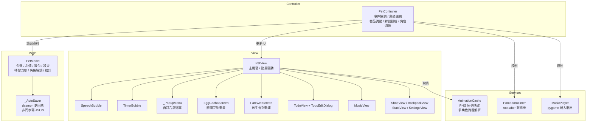

# 桌面小寵物 Desktop Pet

> 視窗程式設計期末專題 ｜ 彰化師範大學 資訊工程學系

一隻常駐桌面的虛擬寵物，結合**番茄鐘工作法**、**多角色 Gacha 系統**、**Todoist 風格待辦清單**與**心情養成機制**，讓讀書與寫程式多一份陪伴與動力。


---

## 功能特色

### 🐾 多角色系統

| 類型 | 角色 | 取得方式 |
|------|------|---------|
| 預設 | 帥潮教授、小紫 | 永遠可用，無需解鎖 |
| Gacha | 橘橘貓咪、雪白兔兔、企鵝紳士、狡黠狐狸、神秘小龍 | 商店購買角色蛋（30 🪙）後孵化解鎖 |

- **孵蛋互動（EggGachaScreen）**：7 次點擊蛋殼逐漸龜裂、粒子爆炸，揭曉時顯示真實角色 idle 動畫
- **放生動畫（FarewellScreen）**：日落天空場景，角色 sprite 漸遠縮小走向遠方，打字機台詞，隨時可略過
- **切換角色**：右鍵選單直接切換；Gacha 角色可放生（從解鎖清單移除）
- **匯入自訂角色**：右鍵 → ➕ 匯入角色素材，選取含 `idle/` 子目錄的資料夾，自動加入清單

### 🍅 番茄鐘計時器

- 工作 → 短休息 → 大休息三階段完整週期
- 彩色 HUD（TimerBubble）顯示倒計時與進度條，三色區分工作（紅）/ 短休息（綠）/ 大休息（藍）
- **完成音效**：工作結束播放四音上行提示音 🎵，休息結束播放三音下行提示音
- 三種快速預設，支援自訂時長；`update_config()` 可執行中熱更新
- 每完成一顆番茄 +10 🪙，加倍符文可達 ×2

| 預設 | 工作 | 短休息 | 大休息 |
|------|------|-------|-------|
| 🍅 經典 | 25 分 | 5 分 | 15 分 |
| 💪 雙倍 | 50 分 | 10 分 | 30 分 |
| ⚡ 迷你 | 15 分 | 3 分 | 10 分 |

### 📋 待辦清單（Todoist 風格）

| 功能 | 說明 |
|------|------|
| 智慧分組 | 逾期 → 今天 → 明天 → 本週 → 之後 → 無截止日期 |
| 左側色條 | 🔴 高 / 🟠 中 / 🟢 低 優先度視覺化 |
| 相對日期 | 「逾期 3 天」「今天 22:00」「明天 07:00」 |
| 個別提醒 | 每筆任務可設定到期前 N 分鐘提示音（C-E-G 三音） |
| 快速新增 | 底部輸入列按 Enter 立即建立任務 |
| 篩選 Tab | 全部 / 未完成 / 今天 / 已完成 |
| 今日輪播 | 每 5 分鐘在對話氣泡中依序提醒今日任務 |
| 響應式視窗 | 可自由縮放，清單區隨視窗高度延伸 |

### 🎵 音樂管理

- 右鍵 → 🎵 音樂管理：列出全部曲目，點擊選播、刪除（含磁碟移除）、匯入新音樂
- 支援 MP3 / OGG / WAV，2 秒淡入淡出切換

### 📊 統計（Forest 風格）

| 指標 | 說明 |
|------|------|
| ⏱️ 累積專注 | 總番茄時間，格式化為 X 小時 Y 分 |
| 📅 今日番茄 | 當日計數，跨日自動重置 |
| 🔥 連續天數 | 每天至少完成一顆番茄即計入 |
| 🌳 我的森林 | 番茄數轉換為 emoji 樹木：🌱→🌿→🌳→🌲 |

### 🪙 金幣與商店

**金幣來源**：番茄鐘 +10、每日簽到 +5、神秘禮盒 5~30 隨機、加倍符文 ×2 加成

**食物**（購買後存入背包，使用即補充心情值）

| 道具 | 費用 | 心情 |
|------|------|------|
| 🍎 蘋果 | 2 🪙 | +15 |
| 🧋 珍珠奶茶 | 3 🪙 | +20 |
| ☕ 咖啡 | 4 🪙 | +25 |
| 🍔 漢堡 | 5 🪙 | +30 |
| 🍣 壽司 | 6 🪙 | +35 |
| 🎂 生日蛋糕 | 8 🪙 | +50 |

**道具與角色**

| 道具 | 費用 | 效果 |
|------|------|------|
| 💊 快樂藥水 | 10 🪙 | 心情立即 100% |
| 🎁 神秘禮盒 | 12 🪙 | 隨機 5～30 金幣 |
| ⚡ 加倍符文 | 15 🪙 | 下一顆番茄金幣 ×2 |
| 🎀 蝴蝶結 | 20 🪙 | 裝飾品 |
| 🥚 角色蛋 | 30 🪙 | 孵出隨機 Gacha 角色 |

### 💬 對話氣泡與心情

- 心情每 90 秒自然衰減 −1，低於 60% / 30% 時觸發對話警示
- 工作中定時關心、番茄結束通知、餵食反應、發呆閒聊（每 3 分鐘）

---

## 安裝與執行

### 必要環境

- Python 3.10+
- `tkinter`（Python 標準安裝內建）

### 選用依賴

```bash
pip install pillow pygame
```

| 套件 | 用途 | 未安裝時 |
|------|------|---------|
| Pillow | 載入角色 PNG 動畫序列 | 顯示文字備用角色 `(ovo)` |
| pygame | 背景音樂播放與淡入淡出 | 靜音執行，其餘功能正常 |

### 執行

```bash
python desktop_pet.py
```

---

## 操作說明

| 操作 | 功能 |
|------|------|
| 左鍵拖曳 | 移動寵物至螢幕任意位置 |
| 右鍵單擊 | 開啟主選單 |

### 右鍵選單結構

```
🎭  角色狀態      → 發呆 / 寫程式 / 讀書 / 睡覺
🎨  切換角色      → 選擇角色 / ⛩️ 放生 / ➕ 匯入素材
─────────────────────────────────────────────
🍅  番茄鐘        → 開始 / 暫停 / 快速預設 / 自訂
🍎  快速餵食      → 背包內食物列表
─────────────────────────────────────────────
🏪  商店
🎒  背包
🎵  音樂管理      → 播放 / 停止 / 選曲 / 刪除 / 匯入
─────────────────────────────────────────────
📋  待辦清單
📊  統計數據
⚙️  設定
─────────────────────────────────────────────
❌  結束程式      → 跳出確認視窗
```

---

## 專案結構

```
Dpet/
├── desktop_pet.py          # 主程式（單檔 MVC，~3,800 行）
├── data.json               # 自動產生的存檔（.gitignore 排除）
└── assets/
    ├── characters.json     # 角色顯示名稱對應表
    ├── icon.ico
    ├── 帥潮教授/            # default 角色素材
    │   ├── idle/           # 待機動畫 PNG 序列（必要）
    │   ├── coding/         # 寫程式動畫
    │   ├── studying/       # 讀書動畫
    │   ├── eating/         # 吃東西動畫
    │   ├── drag/           # 拖曳動畫
    │   ├── alert/          # 警示動畫
    │   └── sleep/          # 睡覺動畫（可選）
    ├── 小紫/                # 第二預設角色（同上結構）
    ├── 貓咪/ 兔兔/ 企鵝/ 狐狸/ 小龍/   # Gacha 角色（需解鎖）
    └── music/
        └── *.mp3           # 背景音樂（.gitignore 排除）
```

> 動畫資料夾內的 PNG 以自然數排序（`_nat_key`）載入並循環播放；缺少的動畫狀態自動 fallback 至 `idle/`。

---

## 架構說明（MVC）



單一檔案 `desktop_pet.py` 分為四層：

| 層級 | 類別 | 職責 |
|------|------|------|
| **Model** | `PetModel`、`_AutoSaver` | 純資料層，無 tkinter。Daemon 執行緒非同步寫 JSON，退出前 `sync_save()` 同步補寫。 |
| **Services** | `AnimationCache`、`MusicPlayer`、`PomodoroTimer` | 業務邏輯，無 tkinter。支援多角色路徑解析與缺失狀態 fallback。 |
| **View** | `PetView`、`SpeechBubble`、`TimerBubble`、`_PopupMenu`、`EggGachaScreen`、`FarewellScreen`、`TodoView`、`MusicView`、`ShopView`、`BackpackView`、`StatsView`、`SettingsView` | 純渲染層，不含業務邏輯。透過 `set_controller()` 連結後啟動事件綁定。 |
| **Controller** | `PetController` | View 事件 → Model 操作 → View 更新。持有 `PomodoroTimer`、`MusicPlayer`，管理對話排程、今日待辦輪播、到期提醒掃描。 |

### 主要元件說明

- **`_PopupMenu`**：以 `Toplevel` + `Frame` 手刻右鍵選單，解決 `tk.Menu.tk_popup()` 在 Windows 非阻塞導致立即消失的 bug；支援子選單 Hover 觸發與全域點擊關閉。
- **`AnimationCache`**：`character == "default"` 時優先讀取 `assets/帥潮教授/{state}/`，PNG 以 `_nat_key()` 自然排序（避免 `slice_10 < slice_2` 的字母排序錯誤），缺失狀態 fallback idle。
- **`EggGachaScreen`**：7 次點擊觸發龜裂動畫（`_cracks` 列表）→ 粒子爆炸（`_particles`）→ 揭曉真實角色 idle sprite（PIL 預載縮放）。
- **`FarewellScreen`**：Canvas 日落場景，預載 10 個縮放尺寸的角色 sprite，根據位移進度選取對應尺寸實現漸縮效果。
- **`TodoView`**：純 grid 佈局，`rowconfigure(weight=1)` 讓清單區隨視窗高度延伸；`_fmt_due()` 將 ISO 時間串轉為相對描述；`_todo_group()` 依到期日分 6 個區段。

---

## 存檔格式

路徑：執行檔或 `.py` 的同層目錄下 `data.json`。

```json
{
  "pet_name":      "小白",
  "coins":         0,
  "happiness":     100,
  "bonus_mult":    1,
  "last_checkin":  "",
  "inventory":     {},
  "first_launch":  false,
  "unlocked_chars": [],
  "todos":         [],
  "stats": {
    "pomodoro_done":   0,
    "coins_earned":    0,
    "coins_spent":     0,
    "items_used":      0,
    "focus_minutes":   0,
    "today_count":     0,
    "today_date":      "",
    "streak_days":     0,
    "last_focus_date": ""
  },
  "settings": {
    "work_min": 25,
    "rest_min": 5,
    "long_rest_min": 15,
    "sessions_before_long": 4,
    "auto_start": false,
    "always_on_top": true,
    "character": "default"
  }
}
```

載入時使用 `_deep_merge()`：已定義欄位從存檔更新，動態欄位（`inventory`、`todos`）完整保留，未知舊欄位自動捨棄，確保向前相容性。

---

## 自訂角色素材規格

在 `assets/` 下建立以角色名稱命名的子目錄，至少需要 `idle/` 資料夾：

```
assets/我的角色/
├── idle/        ← 必要，PNG 序列以數字順序命名
├── coding/
├── studying/
├── eating/
├── drag/
├── alert/
└── sleep/       ← 可選
```

- PNG 建議解析度：200×200 px，RGBA 透明背景
- 命名：`0.png`、`1.png`… 或 `slice_1.png`、`slice_2.png`…
- 透過右鍵選單 → 切換角色 → ➕ 匯入角色素材，選取資料夾後自動複製並更新 `characters.json`

---

## 打包為 exe（PyInstaller）

```powershell
pip install pyinstaller
pyinstaller --onefile --windowed --name DesktopPet `
    --add-data "assets;assets" `
    desktop_pet.py
```

輸出至 `dist/DesktopPet.exe`，需將 `assets/` 資料夾置於 exe 同層目錄。`data.json` 亦儲存於同層目錄（非 PyInstaller 的臨時目錄 `_MEIPASS`）。

---

## 開發環境

- Python 3.12 / Windows 11
- Pillow 10、pygame 2.6、PyInstaller 6

---

## 授權

本專案以 [MIT License](LICENSE) 釋出，歡迎自由使用與修改。
