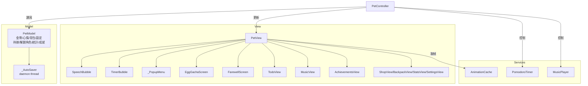

# 桌面小寵物 Desktop Pet

> 視窗程式設計期末專題　|　彰化師範大學 資訊工程學系

一隻常駐桌面的虛擬寵物，結合**番茄鐘工作法**、**多角色 Gacha 系統**、**Todoist 風格待辦清單**、**成就系統**與**學習週報**，以 MVC 架構實作於單一 Python 檔案（約 4,000 行）。


---

## 安裝與執行

**必要**：Python 3.10+（`tkinter` 內建）

```bash
pip install pillow pygame keyboard plyer
python desktop_pet.py
```

| 套件 | 用途 | 缺少時 |
|------|------|--------|
| Pillow | 角色 PNG 動畫 | 顯示文字備用角色 `(ovo)` |
| pygame | 背景音樂 | 靜音執行 |
| keyboard | 全域快捷鍵 | 快捷鍵停用（不影響其他功能） |
| plyer | Windows 系統通知 | 通知停用 |

---

## 功能

### 多角色系統

| 類型 | 角色 | 取得方式 |
|------|------|---------|
| 預設 | 帥潮教授、小紫 | 永遠可用 |
| Gacha | 橘橘貓咪（35%）、雪白兔兔（30%）、企鵝紳士（18%）、狡黠狐狸（12%）、神秘小龍（5%） | 商店買蛋 30 🪙 |

- **孵蛋互動**：購蛋後 7 次點擊破殼，粒子爆炸揭曉真實角色 sprite
- **放生動畫**：日落場景，角色 sprite 漸遠，打字機台詞，可略過
- **匯入自訂角色**：右鍵 → 切換角色 → ➕ 匯入，選含 `idle/` 子目錄的資料夾
- **桌寵大小**：設定視窗 Slider 0.5×~2.0×，即時生效

### 番茄鐘

- 工作 → 短休息 → 大休息循環，頭頂 HUD 顯示倒計時與彩色進度條
- 完成音效：工作結束四音上行（C5-E5-G5-C6），休息結束三音下行（G5-E5-C5）
- Windows 系統通知（右下角 toast）
- 三種快速預設：經典 25/5、雙倍 50/10、迷你 15/3
- 每完成一顆番茄 +10 🪙，**連勝獎勵**（連 3/7/14/30 天各 +15/50/100/200）

### 待辦清單（Todoist 風格）

| 功能 | 說明 |
|------|------|
| 智慧分組 | 逾期（⚠ 紅色 badge）→ 今天 → 明天 → 本週 → 之後 |
| 優先度色條 | 高（紅）/ 中（橙）/ 低（綠）左側可視化 |
| 相對日期 | 「逾期 3 天」「今天 22:00」「明天 07:00」 |
| 重複排程 🔁 | 每天/每週/每月，完成後自動建立下一筆 |
| 個別提醒 | 到期前 N 分鐘提示音（C-E-G 三音）+ 系統通知 |
| 快速新增 | 底部輸入列按 Enter 直接建立 |
| 今日輪播 | 每 5 分鐘氣泡輪流提醒今日與逾期任務 |
| 響應式視窗 | 可自由縮放 |

### 成就系統

12 個成就徽章（番茄王 / 三連勝 / 月月精進 / 大富翁 / 收藏家…），達成時跳出氣泡並觸發 Windows 通知。右鍵 → 📜 成就 檢視全部。

### 統計 & 學習週報（合併視窗）

- **Tab 1 統計**：累積專注時間、今日番茄、連續天數、emoji 森林（🌱→🌿→🌳→🌲）
- **Tab 2 週報**：最近 14 天番茄數 Canvas 棒狀圖，含本週專注時數 / 平均 / 最高日

### 音樂管理

右鍵 → 🎵 音樂管理：選播、刪除（同步移除磁碟）、匯入（MP3/OGG/WAV）。2 秒淡入淡出。

### 商店與心情

心情每 90 秒衰減 −1，低於 60%/30% 觸發對話提醒。

| 類型 | 品項（費用） |
|------|-------------|
| 食物 | 蘋果(2) / 珍奶(3) / 咖啡(4) / 漢堡(5) / 壽司(6) / 蛋糕(8) |
| 道具 | 快樂藥水(10) / 神秘禮盒(12) / 加倍符文(15) / 蝴蝶結(20) |
| 角色 | 角色蛋(30) — Gacha 解鎖 |

金幣：番茄 +10、每日簽到 +5、連勝獎勵、禮盒隨機 5~30。

### 進階功能

| 功能 | 說明 |
|------|------|
| 全域快捷鍵 | Ctrl+Alt+P 番茄鐘、Ctrl+Alt+T 待辦、Ctrl+Alt+S 商店 |
| 存檔匯出/匯入 | 設定視窗一鍵備份 / 還原 `data.json` |
| 寵物點擊互動 | 短點擊（<250ms）觸發隨機台詞 |
| 每日簽到 | +5 金幣 |
| 結束確認 | 防誤觸跳出確認視窗 |

---

## 操作

| 操作 | 效果 |
|------|------|
| 左鍵拖曳 | 移動寵物 |
| 右鍵單擊 | 開啟主選單 |

**主選單結構：**
```
🎭 角色狀態     🎨 切換角色（放生 / 匯入）
🍅 番茄鐘       🍎 快速餵食
🏪 商店         🎒 背包         🎵 音樂管理
📋 待辦清單     📊 統計 & 週報  📜 成就
⚙️ 設定         ❌ 結束程式
```

---

## 專案結構

```
Dpet/
├── desktop_pet.py          # 主程式（單檔 MVC，~4,000 行）
├── data.json               # 自動產生的存檔（.gitignore）
└── assets/
    ├── characters.json     # 角色顯示名稱對應表
    ├── icon.ico
    ├── 帥潮教授/            # default 角色素材
    │   ├── idle/ coding/ studying/ eating/ drag/ alert/ sleep/
    ├── 小紫/                # 第二預設角色
    ├── 貓咪/ 兔兔/ 企鵝/ 狐狸/ 小龍/   # Gacha 角色（需解鎖）
    └── music/              # 背景音樂（.gitignore）
```

---

## 架構（MVC）



| 層 | 類別 | 說明 |
|----|------|------|
| Model | `PetModel`、`_AutoSaver` | 資料層；daemon 執行緒非同步存 JSON |
| Services | `AnimationCache`、`MusicPlayer`、`PomodoroTimer` | 業務邏輯，無 tkinter |
| View | `PetView` 及全部子視窗 | 純渲染，不含業務邏輯 |
| Controller | `PetController` | 協調所有事件、排程、成就檢查 |

---

## 存檔格式（`data.json`）

```json
{
  "pet_name": "小白", "coins": 0, "happiness": 100,
  "unlocked_chars": [], "todos": [], "achievements": [],
  "stats": {
    "pomodoro_done": 0, "focus_minutes": 0,
    "streak_days": 0, "daily_history": [],
    "category_minutes": {}
  },
  "settings": {
    "work_min": 25, "character": "default",
    "pet_scale": 1.0,
    "hotkeys": {"start_pause": "ctrl+alt+p", "open_todo": "ctrl+alt+t", "open_shop": "ctrl+alt+s"}
  }
}
```

---

## 素材規格

角色資料夾至少需要 `idle/` 子目錄，PNG 命名依自然數排序：

```
assets/角色名稱/
├── idle/        ← 必要（PNG 序列）
├── coding/ studying/ eating/ drag/ alert/
└── sleep/       ← 可選，缺少時 fallback idle
```

---

## 打包 exe

```powershell
pip install pyinstaller
pyinstaller --onefile --windowed --name DesktopPet `
    --add-data "assets;assets" desktop_pet.py
```

---

## 開發環境

- Python 3.12 / Windows 11
- Pillow 10、pygame 2.6、keyboard 0.13、plyer、PyInstaller 6

---

## License

[MIT](LICENSE)
