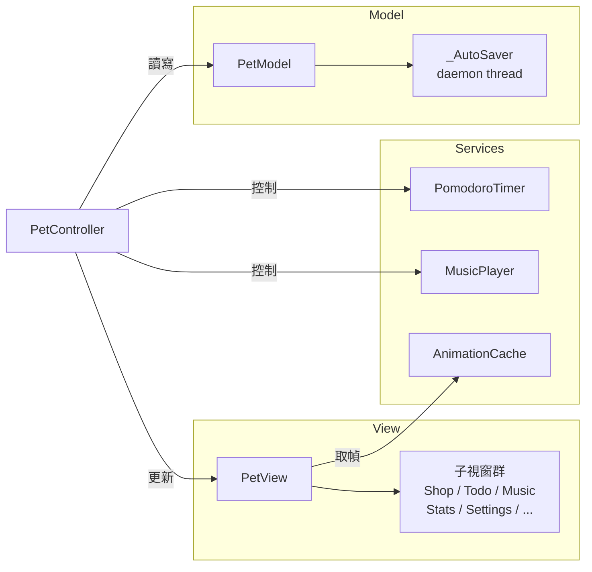

# Desktop Pet — 桌面陪伴生產力工具

視窗程式設計期末專題　｜　彰化師範大學 資訊工程學系

[](https://python.org)
[](LICENSE)

常駐桌面的虛擬寵物，整合番茄鐘工作法、多角色系統與 Todoist 風格待辦清單，以單一 Python 檔案（MVC 架構，~3,800 LOC）實作。

---

## 安裝

**必要**：Python 3.10+（`tkinter` 內建）

```bash
pip install pillow pygame   # 選用：角色動畫圖片 + 背景音樂
python desktop_pet.py
```

| 套件 | 未安裝時的行為 |
|------|----------------|
| Pillow | 顯示文字備用角色，其餘功能正常 |
| pygame | 靜音執行，其餘功能正常 |

---

## 功能

### 多角色系統

- **帥潮教授**、**小紫**：預設可用
- **貓咪、兔兔、企鵝、狐狸、小龍**：在商店花 30 金幣購買角色蛋孵化解鎖（7 次點擊破蛋動畫）
- 解鎖角色可執行放生動畫（角色漸遠離去）
- 支援匯入自訂角色素材資料夾

### 番茄鐘計時器

- 工作 → 短休息 → 大休息三階段循環，完成時播放提示音
- 快速預設：經典 25/5、雙倍 50/10、迷你 15/3
- 每顆番茄 +10 金幣（加倍符文 ×2）

### 待辦清單

- 依到期日自動分組（逾期、今天、明天、本週、之後）
- 優先度色條（高 / 中 / 低）與相對日期顯示（「逾期 3 天」「今天 22:00」）
- 每筆任務可設定到期前 N 分鐘提示音
- 底部快速新增列；今日任務每 5 分鐘在對話氣泡輪播提醒

### 音樂管理

右鍵 → 音樂管理：選播、刪除、匯入（MP3 / OGG / WAV）

### 學習統計

累積專注時間、今日番茄計數、連續天數、emoji 森林視覺化（隨番茄數成長）

### 商店與心情

金幣購買食物補充心情值，心情每 90 秒自然衰減，低於閾值時角色主動提醒。

---

## 操作

| 操作 | 效果 |
|------|------|
| 左鍵拖曳 | 移動寵物至螢幕任意位置 |
| 右鍵單擊 | 開啟主選單（角色、番茄鐘、商店、背包、音樂、待辦、統計、設定） |

---

## 素材規格

在 `assets/` 下建立角色資料夾，至少需包含 `idle/` 子目錄：

```
assets/角色名稱/
├── idle/       # PNG 序列（必要）
├── coding/
├── studying/
├── eating/
├── drag/
├── alert/
└── sleep/      # 可選，缺少時 fallback idle
```

PNG 建議 200×200 px，RGBA 透明背景，命名依數字順序即可（`0.png`、`1.png` 或 `slice_1.png`、`slice_2.png`）。

---

## 架構



| 層 | 類別 | 說明 |
|----|------|------|
| Model | `PetModel`、`_AutoSaver` | 資料層；daemon 執行緒非同步寫 `data.json` |
| Services | `AnimationCache`、`MusicPlayer`、`PomodoroTimer` | 業務邏輯，不依賴 tkinter |
| View | `PetView` 及各子視窗 | 純渲染，透過 `set_controller()` 接入事件 |
| Controller | `PetController` | 協調 View 事件 → Model 操作 → View 更新 |

---

## 存檔格式

執行時自動產生 `data.json`（同層目錄），格式摘要：

```json
{
  "pet_name": "小白",
  "coins": 0,
  "happiness": 100,
  "unlocked_chars": [],
  "todos": [],
  "stats": {
    "pomodoro_done": 0,
    "focus_minutes": 0,
    "streak_days": 0
  },
  "settings": {
    "work_min": 25,
    "character": "default"
  }
}
```

---

## 打包 exe

```powershell
pip install pyinstaller
pyinstaller --onefile --windowed --name DesktopPet `
    --add-data "assets;assets" desktop_pet.py
```

輸出至 `dist/DesktopPet.exe`；執行時 `assets/` 需與 exe 同層目錄。

---

## License

[MIT](LICENSE)
