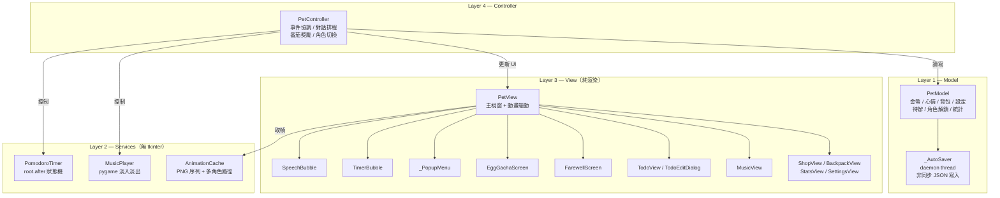

# Desktop Pet — 桌面陪伴生產力工具

> Python Tkinter 期末專題 ｜ 彰化師範大學 資訊工程學系

[](https://python.org)
[](https://docs.python.org/3/library/tkinter.html)
[](https://pillow.readthedocs.io)
[](https://www.pygame.org)
[](LICENSE)

一隻常駐桌面角落的虛擬寵物。整合**番茄鐘（Pomodoro Timer）**、**多角色 Gacha 系統**、**Todoist 風格待辦清單**與**Forest 風格學習統計**，以 MVC 架構實作於單一 Python 檔案（~3,800 LOC）。

---

## 目錄

- [功能概覽](#功能概覽)
- [安裝](#安裝)
- [使用方式](#使用方式)
- [架構設計](#架構設計)
- [存檔格式](#存檔格式)
- [素材規格](#素材規格)
- [打包為 exe](#打包為-exe)
- [開發環境](#開發環境)

---

## 功能概覽

### 多角色系統

程式以資料夾名稱作為角色 ID，透過 `assets/characters.json` 映射顯示名稱。角色分兩類：

| 類型 | 角色 | 取得方式 |
|------|------|---------|
| Free | 帥潮教授（`default`）、小紫 | 永遠可用 |
| Gacha | 橘橘貓咪、雪白兔兔、企鵝紳士、狡黠狐狸、神秘小龍 | 商店購蛋（30 🪙）孵化解鎖 |

**孵蛋互動（`EggGachaScreen`）**：7 次點擊觸發蛋殼龜裂 → 粒子爆炸 → 揭曉真實角色 idle sprite。  
**放生（`FarewellScreen`）**：日落 Canvas 場景 + 角色 sprite 漸遠縮小 + 打字機台詞；可隨時略過。  
**匯入自訂角色**：右鍵選單 → 選取含 `idle/` 子目錄的資料夾，自動 `shutil.copytree` 並更新 `characters.json`。

### 番茄鐘（Pomodoro Timer）

`PomodoroTimer` 以 `root.after(1000)` 驅動狀態機，支援工作 → 短休息 → 大休息完整週期。

- 彩色 HUD（`TimerBubble`）顯示倒計時與進度條
- 快速預設：經典（25/5/15）、雙倍（50/10/30）、迷你（15/3/10）
- `update_config()` 可在執行中熱更新所有參數（不中斷現有計時）
- 每完成一顆番茄 +10 金幣（加倍符文可達 ×2）

### 待辦清單

Todoist 風格設計，主要功能：

- **分組顯示**：逾期 → 今天 → 明天 → 本週 → 之後 → 無截止日期
- **相對日期**：「逾期 3 天」「今天 22:00」等人性化呈現（`_fmt_due()`）
- **優先度色條**：紅 / 橙 / 綠左側色帶，視覺化優先程度
- **到期提醒**：個別任務可設定「到期前 N 分鐘」，由 60 秒週期掃描（`_do_todo_check()`）觸發
- **提醒音效**：`winsound.Beep()` C-E-G 三音上行（background thread）
- **今日輪播**：每 5 分鐘在對話氣泡中依序提醒今日任務
- **響應式視窗**：純 grid 佈局，`rowconfigure(weight=1)` 支援自由縮放

每筆待辦資料結構：

```python
{
    "id":             str,      # uuid4().hex[:8]
    "text":           str,
    "done":           bool,
    "priority":       str,      # "high" | "medium" | "low"
    "category":       str,      # "讀書" | "工作" | "運動" | "生活" | "其他"
    "due_datetime":   str,      # "YYYY-MM-DDTHH:MM" or ""
    "remind_minutes": int,      # 0 = disabled
    "reminded":       bool,     # 防重複提醒
    "note":           str,
}
```

### 統計（Forest 風格）

| 指標 | 追蹤方式 |
|------|---------|
| 累積專注時間 | 每顆番茄 `+work_min` 分鐘 |
| 今日番茄數 | 跨日以 `today_date` 自動重置 |
| 連續天數 | 比對 `last_focus_date` 與昨日 |
| emoji 森林 | 每 10 顆番茄升一階：🌱→🌿→🌳→🌲 |

### 音樂管理（`MusicView`）

`MusicPlayer._scan_tracks()` 掃描 `assets/music/` 目錄下所有 `.mp3/.ogg/.wav`，支援：
- 單曲選播（`play_index(i)`）
- 從磁碟刪除（`delete_track(i)`）
- 匯入新音樂（`shutil.copy2`）
- 2 秒淡入 / 淡出（background thread）

### 金幣與商店

```
番茄鐘完成  +10 幣（可 ×2 加倍）
每日簽到    +5 幣
神秘禮盒    隨機 5~30 幣
```

| 類別 | 品項 | 費用 |
|------|------|------|
| 食物 | 蘋果 / 珍珠奶茶 / 咖啡 / 漢堡 / 壽司 / 生日蛋糕 | 2~8 🪙 |
| 道具 | 快樂藥水 / 神秘禮盒 / 加倍符文 / 蝴蝶結 | 10~20 🪙 |
| 角色 | 角色蛋（隨機 Gacha） | 30 🪙 |

---

## 安裝

### 必要環境

- Python ≥ 3.10
- `tkinter`（Python 標準安裝內建）

### 可選依賴

```bash
pip install pillow pygame
```

| 套件 | 用途 | 缺少時的降級行為 |
|------|------|----------------|
| `Pillow` | 載入 PNG 動畫序列、RGBA 合成 | 顯示文字備用角色 `(ovo)` |
| `pygame` | 背景音樂播放 | 靜音執行，其餘功能不受影響 |

### 執行

```bash
# 建議使用虛擬環境
python -m venv .venv
.venv\Scripts\activate       # Windows
pip install pillow pygame

python desktop_pet.py
```

---

## 使用方式

| 操作 | 效果 |
|------|------|
| 左鍵拖曳 | 移動寵物至螢幕任意位置 |
| 右鍵單擊 | 開啟 `_PopupMenu` 主選單 |

### 右鍵選單結構

```
🎭  角色狀態       idle / coding / studying / sleep
🎨  切換角色       自由角色 + 已解鎖 Gacha 角色 / ⛩️ 放生 / ➕ 匯入素材
───────────────────────────────────────────────
🍅  番茄鐘         開始 / 暫停 / 快速預設 / 自訂時間
🍎  快速餵食       背包內食物
───────────────────────────────────────────────
🏪  商店
🎒  背包
🎵  音樂管理       選播 / 刪除 / 匯入
───────────────────────────────────────────────
📋  待辦清單
📊  統計數據
⚙️  設定
───────────────────────────────────────────────
❌  結束程式       跳出確認視窗
```

---

## 架構設計

整個專案實作於單一 `desktop_pet.py`，依 MVC 分為四層：



### 關鍵設計決策

**`_PopupMenu`（自訂右鍵選單）**  
`tk.Menu.tk_popup()` 在 Windows 為非阻塞呼叫，`try/finally: menu.unpost()` 導致選單瞬間關閉。解法：以 `Toplevel` + `Frame` 完全手刻選單，支援子選單 Hover 觸發與全域點擊關閉。

**`AnimationCache` 路徑解析**  
`character == "default"` 時優先查找 `assets/帥潮教授/{state}/`，fallback `assets/{state}/`，確保使用者移動素材後無需修改程式碼。PNG 以 `_nat_key()` 自然排序（`re.split(r'(\d+)', s)`）避免 `slice_10 < slice_9` 的字母排序問題。

**`_AutoSaver` 非同步存檔**  
每次 `Model._dirty()` 呼叫將存檔任務推入 `queue.Queue`，daemon 執行緒逐一處理，避免頻繁 disk I/O 阻塞 GUI 主執行緒。退出前呼叫 `sync_save()` 同步寫入最終狀態。

**`TodoView` 響應式佈局**  
整個視窗改用純 grid 佈局（tkinter 不允許同容器 pack + grid 混用），設 `rowconfigure(2, weight=1)` 讓清單區隨視窗高度延伸；Canvas + Scrollbar 以 grid sticky="nsew" 實現完整填充。

---

## 存檔格式

路徑：執行檔 / `.py` 同層目錄 `data.json`

```json
{
  "pet_name":      "小白",
  "coins":         0,
  "happiness":     100,
  "bonus_mult":    1,
  "last_checkin":  "",
  "inventory":     {},
  "first_launch":  false,
  "unlocked_chars": [],
  "todos":         [],
  "stats": {
    "pomodoro_done":   0,
    "coins_earned":    0,
    "coins_spent":     0,
    "items_used":      0,
    "focus_minutes":   0,
    "today_count":     0,
    "today_date":      "",
    "streak_days":     0,
    "last_focus_date": ""
  },
  "settings": {
    "work_min": 25, "rest_min": 5,
    "long_rest_min": 15, "sessions_before_long": 4,
    "auto_start": false, "always_on_top": true,
    "character": "default"
  }
}
```

載入時以 `_deep_merge()` 深層合併：已知欄位從存檔更新，`inventory` / `todos` 等動態 dict 完整保留，未知舊欄位靜默丟棄，確保版本向前相容。

---

## 素材規格

角色子目錄結構（以帥潮教授為例）：

```
assets/帥潮教授/
├── idle/       # PNG 序列，至少 1 幀（必要）
├── coding/
├── studying/
├── eating/
├── drag/
├── alert/
└── sleep/      # 可選，缺少時 fallback idle
```

- PNG 以自然數排序（`0.png`、`1.png` 或 `slice_1.png`、`slice_2.png`）
- 建議解析度：200×200 px，RGBA 透明背景
- 缺少狀態資料夾時，`AnimationCache` 自動 fallback 至 `idle/`

---

## 打包為 exe

```powershell
pip install pyinstaller
pyinstaller --onefile --windowed --name DesktopPet `
    --add-data "assets;assets" `
    desktop_pet.py
```

輸出 `dist/DesktopPet.exe`，執行時需將 `assets/` 與 `data.json` 置於 exe 同層目錄。  
`resource_path()` 在打包後從 `sys._MEIPASS` 解析路徑，開發時從 `__file__` 所在目錄解析。

---

## 開發環境

| 項目 | 版本 |
|------|------|
| Python | 3.12 |
| OS | Windows 11 |
| Pillow | 10.x |
| pygame | 2.6 |
| PyInstaller | 6.x |

---

## License

[MIT](LICENSE)
