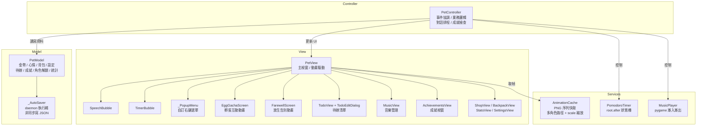

# 桌面小寵物 (Desktop Pet)

> 視窗程式設計期末專題 ｜ 彰化師範大學 資訊工程學系

一隻常駐桌面角落的虛擬寵物。結合**番茄鐘工作法**、**多角色 Gacha 系統**、**Todoist 風格待辦清單**、**成就系統**與**學習週報**，讓讀書和寫程式多一份陪伴與動力。


---

## 功能特色

| 功能 | 說明 |
|------|------|
| 多角色系統 | 帥潮教授 / 小紫預設可用；貓咪、兔兔、企鵝、狐狸、小龍需商店購蛋解鎖 |
| 孵蛋互動 | 購買角色蛋後點擊 7 次破殼，粒子爆炸揭曉真實角色動畫 |
| 放生動畫 | 日落天空場景，角色 sprite 漸遠離去，打字機台詞，可隨時略過 |
| 番茄鐘計時器 | 工作 / 短休息 / 大休息三階段，彩色 HUD 進度條；完成播放提示音並獎勵金幣 |
| 連勝獎勵 | 連續 3 / 7 / 14 / 30 天專注各獎 +15 / 50 / 100 / 200 金幣 |
| 角色對話氣泡 | 工作中定時關心、心情警示、吃東西反應、發呆閒聊 |
| 待辦清單 | Todoist 風格分組顯示、優先度色條、逾期 badge、重複排程、個別到期提醒 |
| 成就系統 | 12 個成就徽章（番茄王 / 三連勝 / 月月精進 / 收藏家…），解鎖時氣泡通知 |
| 統計 & 學習週報 | 累積專注時間、連續天數、emoji 森林；14 天棒狀圖含本週專注時數 |
| 金幣系統 | 番茄鐘 +10 金幣（可加倍）、每日簽到 +5 金幣、連勝額外獎勵 |
| 虛擬商店 | 食物補充心情值；道具有藥水、禮盒、加倍符文；角色蛋解鎖新角色 |
| 背包系統 | 購買後存入背包，開啟背包視窗後點擊使用 |
| 心情養成 | 心情每 90 秒衰減 -1，低於 30% / 60% 觸發對話提醒 |
| 音樂管理 | 視窗化曲目管理，支援選播、刪除、匯入（MP3 / OGG / WAV） |
| 匯入自訂角色 | 右鍵選單直接匯入含 `idle/` 子目錄的任意角色素材資料夾 |
| 桌寵大小調整 | 設定視窗 Slider 0.5× ～ 2.0×，即時生效 |
| 存檔匯出 / 匯入 | 設定視窗一鍵備份或還原 `data.json` |
| 寵物點擊互動 | 短點擊（< 250ms）觸發隨機台詞 |
| 個人化設定 | 寵物名稱、番茄鐘時長、每輪節數、自動開始、永遠置頂 |
| Windows 通知 | 番茄完成 / 成就解鎖 / 待辦到期時彈出系統 toast 通知 |
| 自動存檔 | 每次狀態變動立即以背景執行緒寫入 `data.json`，重啟後完整保留 |
| 結束確認 | 點選「結束程式」後跳出確認視窗，防止誤觸 |

---

## 安裝與執行

### 必要環境

- Python 3.10+
- `tkinter`（Python 標準安裝內建）

### 選用依賴

```bash
pip install pillow pygame plyer
```

| 套件 | 用途 | 未安裝時 |
|------|------|---------|
| Pillow | 載入角色 PNG 動畫序列 | 顯示備用文字寵物 `(ovo)` |
| pygame | 背景音樂播放（淡入淡出） | 靜音執行，其餘功能正常 |
| plyer | Windows 系統 toast 通知 | 通知停用，其餘功能正常 |

### 執行

```bash
python desktop_pet.py
```

---

## 操作說明

| 操作 | 功能 |
|------|------|
| 左鍵拖曳 | 將寵物移動至螢幕任意位置 |
| 左鍵短點擊 | 觸發隨機台詞互動 |
| 右鍵單擊 | 開啟主選單 |

### 番茄鐘快速預設

| 預設 | 工作 | 短休息 | 大休息 |
|------|------|-------|-------|
| 🍅 經典 | 25 分 | 5 分 | 15 分 |
| 💪 雙倍 | 50 分 | 10 分 | 30 分 |
| ⚡ 迷你 | 15 分 | 3 分 | 10 分 |

### 角色系統

| 類型 | 角色 | 取得方式 |
|------|------|---------|
| 預設 | 帥潮教授 | 永遠可用 |
| 預設 | 小紫 | 永遠可用 |
| Gacha | 橘橘貓咪（機率 35%） | 商店購買角色蛋 30 🪙 |
| Gacha | 雪白兔兔（機率 30%） | 商店購買角色蛋 30 🪙 |
| Gacha | 企鵝紳士（機率 18%） | 商店購買角色蛋 30 🪙 |
| Gacha | 狡黠狐狸（機率 12%） | 商店購買角色蛋 30 🪙 |
| Gacha | 神秘小龍（機率  5%） | 商店購買角色蛋 30 🪙 |

### 商店道具

**食物**（補充心情值）

| 道具 | 費用 | 心情回復 |
|------|------|---------|
| 🍎 蘋果 | 2 🪙 | +15 |
| 🧋 珍珠奶茶 | 3 🪙 | +20 |
| ☕ 咖啡 | 4 🪙 | +25 |
| 🍔 漢堡 | 5 🪙 | +30 |
| 🍣 壽司 | 6 🪙 | +35 |
| 🎂 生日蛋糕 | 8 🪙 | +50 |

**道具**

| 道具 | 費用 | 效果 |
|------|------|------|
| 💊 快樂藥水 | 10 🪙 | 心情立即恢復 100% |
| 🎁 神秘禮盒 | 12 🪙 | 隨機獲得 5～30 金幣 |
| ⚡ 加倍符文 | 15 🪙 | 下個番茄鐘金幣 ×2 |
| 🎀 蝴蝶結 | 20 🪙 | 可愛裝飾品 |
| 🥚 角色蛋 | 30 🪙 | 孵化隨機 Gacha 角色 |

---

## 專案結構

```
Dpet/
├── desktop_pet.py          # 主程式（單檔 MVC 架構，~4,000 行）
├── data.json               # 自動產生的存檔（.gitignore 排除）
└── assets/
    ├── characters.json     # 角色顯示名稱對應表
    ├── icon.ico
    ├── 帥潮教授/            # 預設角色素材
    │   ├── idle/           # 待機動畫 PNG 序列（必要）
    │   ├── coding/         # 寫程式動畫
    │   ├── studying/       # 讀書動畫
    │   ├── eating/         # 吃東西動畫
    │   ├── drag/           # 拖曳動畫
    │   ├── alert/          # 警示動畫
    │   └── sleep/          # 睡覺動畫（可選）
    ├── 小紫/                # 第二預設角色（同上結構）
    ├── 貓咪/ 兔兔/ 企鵝/ 狐狸/ 小龍/   # Gacha 角色（需解鎖）
    └── music/
        └── *.mp3           # 背景音樂（.gitignore 排除）
```

> 動畫資料夾內的 PNG 以自然數排序（`_nat_key`）載入並循環播放；缺少的動畫狀態自動 fallback 至 `idle/`。

---

## 架構說明（MVC）



整個專案以單一檔案 `desktop_pet.py` 實作，分為四個明確分層：

| 層級 | 類別 | 職責 |
|------|------|------|
| **Model** | `PetModel`、`_AutoSaver` | 純資料層，不含任何 tkinter。`_AutoSaver` 以 daemon 執行緒非同步寫入 JSON，退出前 `sync_save()` 補寫。 |
| **Services** | `AnimationCache`、`MusicPlayer`、`PomodoroTimer` | 業務邏輯，不依賴 tkinter。動畫快取支援多角色路徑解析與 scale 縮放；pygame 淡入淡出；`root.after()` 驅動計時器。 |
| **View** | `PetView` 及全部子視窗 | 純渲染層，不含業務邏輯。透過 `set_controller()` 連結後啟動事件綁定。 |
| **Controller** | `PetController` | 接收 View 事件 → 操作 Model → 驅動 View 更新。管理對話排程、今日待辦輪播、到期提醒掃描、成就檢查、每日歷史記錄。 |

### 主要元件說明

- **`_PopupMenu`**：以 `Toplevel + Frame` 手刻右鍵選單，解決 `tk.Menu.tk_popup()` 在 Windows 非阻塞導致立即消失的問題；支援子選單 Hover 觸發與全域點擊關閉。
- **`AnimationCache`**：`character == "default"` 時優先讀取 `assets/帥潮教授/{state}/`，PNG 以 `_nat_key()` 自然排序（避免 `slice_10 < slice_2`），缺失狀態 fallback idle，支援 `scale` 縮放。
- **`EggGachaScreen`**：7 次點擊觸發龜裂動畫（`_cracks` 列表）→ 粒子爆炸（`_particles`）→ 揭曉時以 PIL 預載並縮放角色真實 idle sprite 動畫。
- **`FarewellScreen`**：Canvas 日落場景，預載 10 個縮放尺寸的角色 sprite，根據位移進度選取對應尺寸實現漸縮；打字機台詞，可略過。
- **`StatsView`**：`ttk.Notebook` 兩 Tab，Tab1 統計數據（含 emoji 森林視覺化），Tab2 最近 14 天學習週報（Canvas 棒狀圖）。
- **`PomodoroTimer`**：支援工作 → 短休息 → 大休息完整週期；`update_config()` 可在執行中熱更新所有參數而不中斷計時。

---

## 存檔格式

存檔路徑：執行檔或 `.py` 的同層目錄下的 `data.json`。

```json
{
  "pet_name": "小白",
  "coins": 0,
  "happiness": 100,
  "bonus_mult": 1,
  "last_checkin": "",
  "inventory": {},
  "first_launch": false,
  "unlocked_chars": [],
  "todos": [],
  "achievements": [],
  "stats": {
    "pomodoro_done": 0,
    "coins_earned": 0,
    "coins_spent": 0,
    "items_used": 0,
    "focus_minutes": 0,
    "today_count": 0,
    "today_date": "",
    "streak_days": 0,
    "last_focus_date": "",
    "streak_bonus_date": "",
    "daily_history": [],
    "category_minutes": {}
  },
  "settings": {
    "work_min": 25,
    "rest_min": 5,
    "long_rest_min": 15,
    "sessions_before_long": 4,
    "auto_start": false,
    "always_on_top": true,
    "character": "default",
    "pet_scale": 1.0
  }
}
```

載入時使用深層合併（`_deep_merge`）：已定義欄位從存檔更新，動態欄位（`inventory`、`todos`）完整保留，未知舊欄位自動捨棄，確保版本相容性。

---

## 自訂角色素材規格

在 `assets/` 下建立以角色名稱命名的資料夾，至少需要 `idle/` 子目錄：

```
assets/角色名稱/
├── idle/       # PNG 序列（必要）
├── coding/
├── studying/
├── eating/
├── drag/
├── alert/
└── sleep/      # 可選，缺少時自動 fallback idle
```

- 建議解析度：200×200 px，RGBA 透明背景
- 命名：`0.png`、`1.png`… 或 `slice_1.png`、`slice_2.png`…（程式使用自然數排序）
- 透過右鍵選單 → 切換角色 → ➕ 匯入角色素材直接加入

---

## 打包為 exe（PyInstaller）

```powershell
pip install pyinstaller
pyinstaller --onefile --windowed --name DesktopPet `
    --add-data "assets;assets" `
    desktop_pet.py
```

執行檔輸出至 `dist/DesktopPet.exe`，需將 `assets/` 資料夾放在 exe 同層目錄。`data.json` 也會儲存於 exe 同層目錄（非 PyInstaller 的臨時目錄 `_MEIPASS`）。

---

## 開發環境

- Python 3.12 / Windows 11
- Pillow 10、pygame 2.6、plyer、PyInstaller 6

---

## 授權

本專案以 [MIT License](LICENSE) 釋出，歡迎自由使用與修改。
